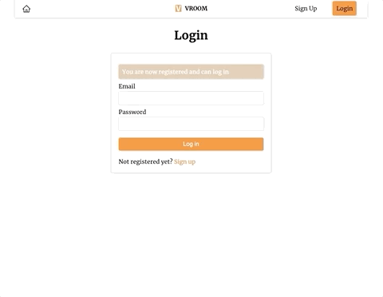

# Carpool Project - Vroom

## Description

Vroom is a carpool app that allows pasengers and drivers to publish their trips to fill in the available seats, so as to save/earn money.

[View Live Demo](https://carpool-project-an.herokuapp.com)

## Instructions

The homepage of the app is mainly a map with some input area where users can fill in trip-related information. Anyone can have access to this page to get a quote of their potential trip, but in order to publish their trip either as a driver or a passenger, he/she will have to log in.

1. Sign up as either a passenger or a driver (drivers will need some extra information on their cars)
2. After signed up, users will be automatically redirected to the login page (once logged in, their authentication will last until they click the logout button)
3. Once in the homepage, users' current address will be obtained by default unless unauthorized, then a default Montreal address will apply. Users can either drag the pin to anywhere on the map or type into the box below to set their trip start point
4. After entering destination, the map will automatically display the direction route of driving
5. Enter other required information: seats needed/offered and earliest/latest set out time. Drivers will also have an option of choosing to be 'passenger' or 'driver' this time
6. After clicking the 'GO' button, an error box will show if there are any error filling in the required form, otherwise a confirmation box will pop up summarizing the trip information and price
7. If users post the trip, they will be redirected to a page listing all matched trips. Passengers can only invite driver to pick them up, while drivers are enpowered to make the final decision
8. Users can access all history and current trips, cancel current ones, see the list of invitation if have not been matched or full load, see the final match, etc.

## Installation

1. Navigate to the server directory and run `yarn dev`
2. Navigate to the client directory and run `yarn start`

:exclamation: For dev purpose: You may need a Google-Map-API-Key from the [Google Cloud Platform](https://console.cloud.google.com)

## Screenshots

### Sign up

- You can choose a role to sign up
- 2-step validation
  - Required fields and password
  - Database match

### Login

### Set up trip origin and destination

#### Features

- Current location aotu-detection
- Drag pin with map centered and input area updated synchronously
- Address auto-complete
- Direction automatically rendered once start and end point are ready

### Fill in requiered passenger/driver information

### Post trip as a passenger

#### Features

- Pre-determined price based on seats needed and travel distance
- A list of matched driver trips based on origin and destination cities, schedule and number of seats
- Invite/Cancel button to call those drivers' attention
- Profile page with all trips ever posted

### Post trip as a driver

#### Features

- Choose your role of travel this time
- If as a driver, pick passengers you like, power disabled if full load

### Cancel a trip

## Technologies

### Frontend

- React.js
- JavaScript
- Styled Component
- Redux

### Backend

- Node.js
- Express
- Passport
- MongoDB

## API Endpoints

| Method   | Endpoint                       | Description                                            |
| -------- | ------------------------------ | ------------------------------------------------------ |
| `POST`   | `/api/users/register`          | creates a new user                                     |
| `POST`   | `/api/users/login`             | creates a new authentication session and returns user  |
| `GET`    | `/api/users/login`             | checks authentication                                  |
| `DELETE` | `/api/users/logout`            | clears authentication and cookies                      |
| ------   | --------                       | -----------                                            |
| `POST`   | `/api/trips`                   | creates a new trip                                     |
| `GET`    | `/api/trips/:_id`              | returns the detailed trip information by ID            |
| `GET`    | `/api/trips/matched/:_id`      | returns a list of matched trips by trip ID             |
| `GET`    | `/api/trips/users/:userId`     | returns a list of history and current trips by user ID |
| `PUT`    | `/api/trips/addInvite/:_id`    | adds new invitaton to trip                             |
| `PUT`    | `/api/trips/removeInvite/:_id` | cancel invitaton to trip                               |
| `PUT`    | `/api/trips/addPick/:_id`      | creates connection between trips                       |
| `PUT`    | `/api/trips/cancelPick/:_id`   | cancel connection between trips                        |
| `PUT`    | `/api/trips/cancel/:_id`       | cancel posted trip                                     |

## Potential To-do list

- Access for registered passengers to switch to driver role by filling in more information
- Change to date picker when asking for user information
- Render drivers' car information in the matched list page, so that the passengers are better informed to send out invitation
- Limit passengers' invitation number to be 5 or 10
- Enable live chat functionality so that parties can exchange more information like set out time or so

## Contact

Created by [@Ning An](https://github.com/ning-an) - feel free to contact me!
